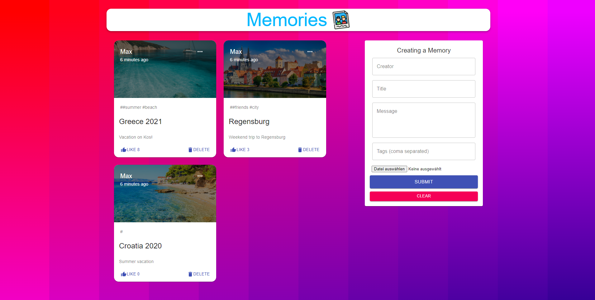

# mern-fullstack-application

Website which allows users to post Posts. \
All posts are stored in a MongoDB cluster. 

Node.js and express as backend, React as Frontend. \
Also uses redux and axios. \
Supports CRUD operations. 

##

